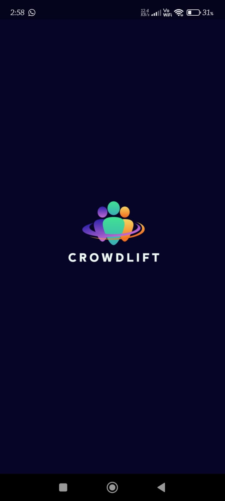

# CrowdLift

CrowdLift is an innovative platform designed to bridge the gap between **investors** and **business seekers**. Whether you're a visionary entrepreneur looking for funding or an investor seeking the next big opportunity, CrowdLift offers a trusted and seamless environment for meaningful connections and growth.

---

## 🚀 Introduction

CrowdLift simplifies the process of investment and collaboration by offering an intuitive platform where:

- **Investors** can explore promising business ideas.
- **Business seekers** can showcase their vision and attract funding.
- Both parties can communicate, negotiate, and formalize secure agreements — all within the app.

---

## 🎯 Objective

CrowdLift focuses on building **trust** and **transparency** through:

- Secure agreements.
- Verified profiles.
- Admin-controlled document editing.
- Easy communication channels.
- A structured approach for both investment discovery and management.

---

## 💡 Key Features

- 🔗 **Investor-Seeker Connections**  
  Seamless interaction between investors and entrepreneurs.

- 💬 **Direct Communication**  
  Chat, email, or call directly from the app for efficient collaboration.

- 📜 **Secure Agreements**  
  Generate, lock, and edit business agreements only with admin approval.

- 💸 **Transaction History**  
  Track payments and receipts to ensure smooth financial management.

- 👤 **User Profile Management**  
  Create and manage professional profiles tailored to your role.

- 🔍 **Advanced Search Options**  
  Search users by name, email, phone, or role for quick navigation.

- 🧾 **About Us Section**  
  Learn about the platform and its mission through a clear and user-friendly information page.

---

## 📸 App Screenshots

### 🔹 Splash & Onboarding

| Splash | Onboarding 1 | Onboarding 2 |
|--------|--------------|--------------|
|  |  |  |

| Onboarding 3 | Register | Login |
|--------------|----------|-------|
|  |  |  |

---

### 🔹 Core Navigation

| Home | Seeker | Investor |
|------|--------|----------|
|  |  |  |

| User Profile | Chat | Payment |
|--------------|------|---------|
|  |  |  |

---

### 🔹 Other Screens

| Agreement | Transaction History | About |
|-----------|----------------------|-------|
|  |  |  |

| Drawer | User Info | — |
|--------|-----------|----|
|  |  |  |

## ⚙️ Tech Stack

- **Frontend:** Flutter / Dart
- **Backend:** Firebase / Firestore (or your choice)
- **Authentication:** Firebase Auth / Google Sign-In
- **Messaging & Calls:** Integrated In-App Communication

---
